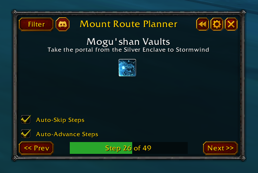
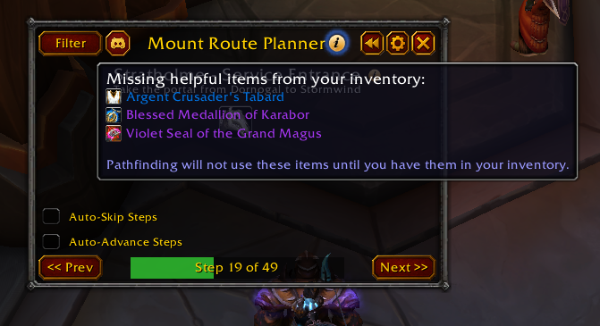

# Mount Route Planner (MRP)

**Mount Route Planner (MRP)** is an advanced World of Warcraft addon designed for mount collectors who want to farm efficiently and with minimal hassle.

MRP automatically generates optimized farming routes based on your character's current collection, available travel options, and location. No more manually copying data from external websites—just open the addon and start farming.

### Features

**Smart Mount Detection**  
Automatically checks your character's collected mounts and builds a personalized route of missing ones.

**Dynamic Route Planning**  
Uses a built-in pathfinding system to determine the most efficient next objective. Supports in-game travel options such as hearthstones, mage teleports, and portals.

**World Map Route Overview**
Shows your filtered route directly on the world map with numbered pins, directional connectors, and current-step context.

**In-Game Update Notes**
Displays a changelog popup after addon updates so new features are visible immediately in-game.

**Helpful Item Tracking**
Tracks important items like teleportation stones, hearthstones, and other travel abilities. It will notify you if you are missing any required items for optimizing your route.

    
**Step-by-Step Tracking**  
Follow a clean interface that tracks your progress and shows upcoming rewards. Optional waypoint visualization is available via TomTom.

**Automatic Step Skipping**  
Skips unnecessary steps based on:

*   Already collected mounts
*   Instance or boss lockouts
*   Current map or zone constraints

**Auto-Advance Option**  
Automatically moves to the next step when one is completed, if enabled.

**Nearby Source Alerts**
Highlights relevant world bosses, rares, treasures, quests, and vendors when they are nearby, including a quick target button.

**Full Content Support**  
Covers all mount content, including the latest expansion, _The War Within_.

**Localization Support**  
Supports multiple languages (in progress).

### How to Use

1.  Install the addon and load your character in-game.
2.  Open MRP from the minimap button or via a slash command.
3.  The addon will automatically scan your collection and generate a route for all missing mounts.
4.  You can customize filters to focus on specific content (e.g., expansions, difficulties, or instance types).
5.  Follow the route to farm your selected missing mounts efficiently.

 

### Slash Commands

*   `/mrp` — Open or close the main window
*   `/mrp reset` — Reset your current progress and steps
*   `/mrp settings` — Open the settings panel
*   `/mrp changelog` — Open the in-game changelog popup
*   `/mrp route` — Recalculate the optimized route
*   `/mrp tomtom on` or `/mrp tomtom off` — Enable or disable tomtom integration
*   `/mrp updatedisplaydelayed <number>` — Force update of the display after a delay (default: 0.25 seconds)

### Support and Feedback

Have a question, found a bug, or want to suggest a feature?  
Join our community on [Discord](https://discord.gg/TrJFGcah7z) and connect with other collectors and addon users.

Happy mount farming!